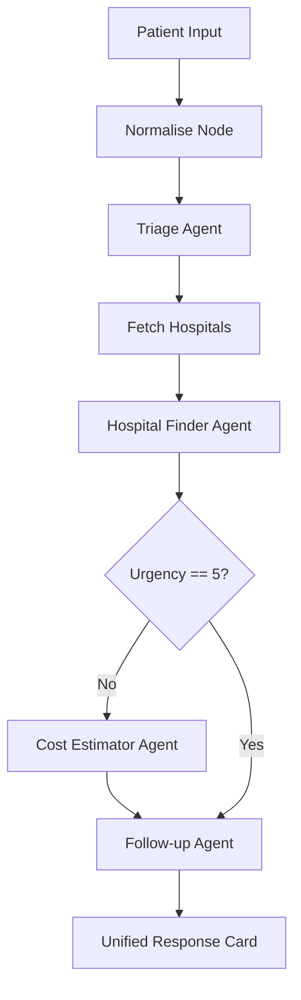

# HealthBridge 🏥

HealthBridge is an AI-powered multi-agent healthcare access navigator for Pakistan. It helps patients navigate the healthcare system by assessing symptoms and recommending the nearest affordable hospitals with transparent cost estimates.

## 🌟 Features

- **AI Triage**: Assess symptom urgency in English or Urdu.
- **Hospital Finder**: Recommends the top 3 nearest hospitals based on urgency and cost.
- **Cost Estimation**: Provides realistic PKR cost ranges for consultations and procedures.
- **Actionable Steps**: Clear "Next Steps" including immediate actions and hospital-specific guidance.
- **Voice Support**: Integrated Urdu/English voice-to-text for easy input.
- **Interactive Maps**: Visual hospital pins using Leaflet.

## 🏗️ Architecture



## 🛠️ Tech Stack

| Layer | Technology |
|---|---|
| **Frontend** | Next.js 14, Tailwind CSS, shadcn/ui, Framer Motion |
| **Backend** | FastAPI, LangGraph, LangChain, Anthropic Claude |
| **Database** | Supabase (PostgreSQL + PostGIS) |
| **Voice** | OpenAI Whisper |

## 🚀 Setup Instructions

1. **Clone & Install Backend**
   ```bash
   cd backend
   pip install -r requirements.txt
   ```

2. **Clone & Install Frontend**
   ```bash
   cd frontend
   npm install
   npx shadcn-ui@latest init --defaults
   ```

3. **Environment Setup**
   - Copy `backend/.env.example` to `backend/.env` and fill keys.
   - Copy `frontend/.env.local.example` to `frontend/.env.local`.

4. **Database Migration**
   - Run the SQL in `supabase/migrations/001_create_hospitals.sql` in your Supabase SQL Editor.

5. **Run Applications**
   - **Backend**: `uvicorn main:app --reload --port 8000`
   - **Frontend**: `npm run dev`

## 📝 License

MIT
